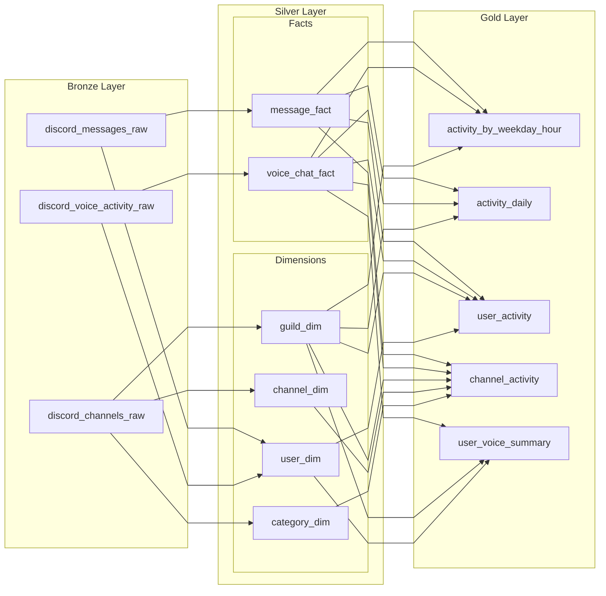

# Bronze-Gold データモデル可視化

`kazuki_jedai` の現行 DLT 実装に基づく、Bronze → Silver → Gold の依存関係可視化。

- Bronze→Silver: `scripts/03_silver/01_silver_cleansing_dlt_integrated.py`
- Silver→Gold: `scripts/04_gold/01_gold_aggregation_dlt.py`

## 1. レイヤ全体図（Bronze → Silver → Gold）

## 2. 補足（実装上のポイント）

- `activity_by_weekday_hour` は `voice_chat_fact` を時間帯按分して集計。
- `activity_daily` は `voice_chat_fact` を日按分して集計。
- `user_voice_summary` は `voice_chat_fact` のみを集計元として使用。
- 一部アプリクエリ（`activity_by_category_daily`）は Silver 直接参照だが、本資料は Bronze→Gold の物理テーブル依存のみを対象。
